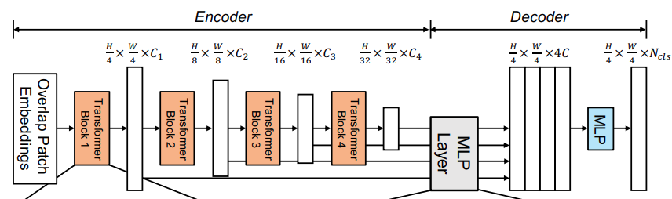
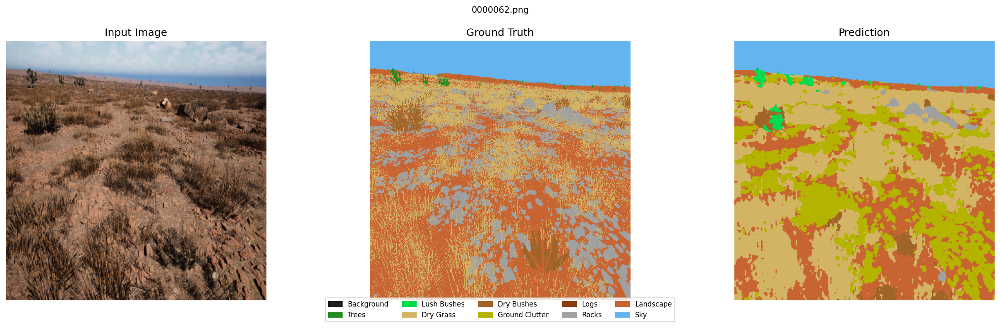
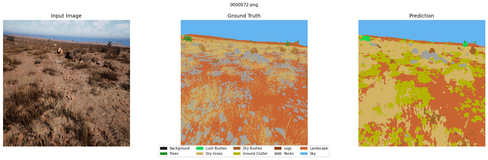
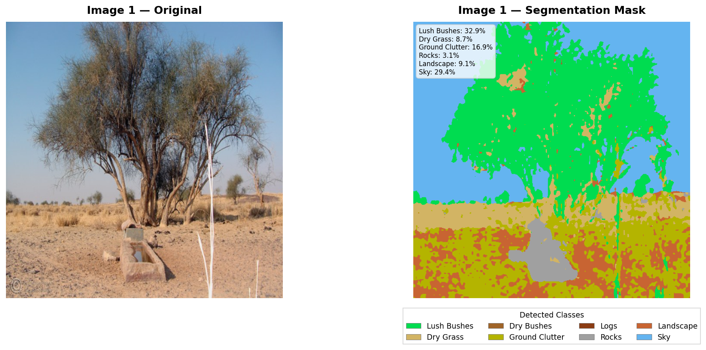
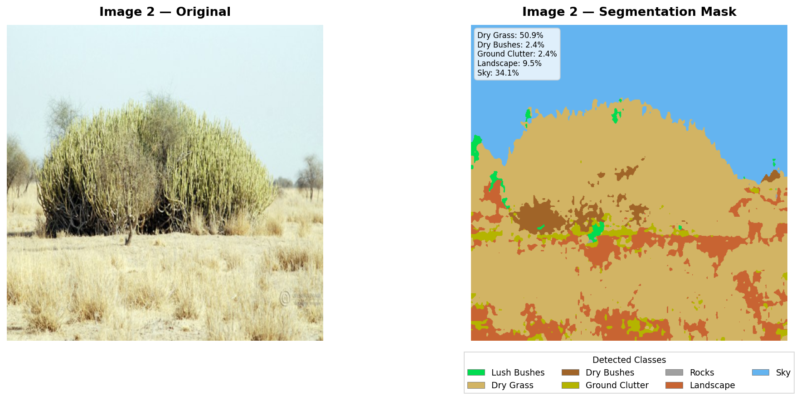

# 🌵 Offroad Semantic Segmentation System  
🚀 Transformer-Based Semantic Segmentation using SegFormer-B2  

Accurate pixel-level understanding of desert environments using deep learning  

---

## 💡 About the Project  

This project focuses on semantic segmentation of desert images, where each pixel is classified into predefined categories such as sky, landscape, vegetation, rocks, and logs.  

We implemented a **SegFormer-B2 transformer-based model**, combined with advanced training strategies like **transfer learning, weighted loss, and augmentation**, to achieve robust performance under domain shift conditions.  

---

## ✨ Features  
- 🧠 Transformer-based SegFormer-B2 architecture  
- ⚡ Efficient training with limited GPU  
- 🎯 High IoU performance (~0.53+)  
- 📊 Per-class evaluation & confusion matrix  
- 🔄 Data augmentation for better generalization  
- 🧩 Pixel-level segmentation output  

---

## ⚙️ Tech Stack  
- Deep Learning: PyTorch, Transformers  
- Languages: Python  
- Libraries: OpenCV, NumPy, Matplotlib  
- Tools: VS Code, Google Colab  

---

## 📁 Project Structure

```
.
├── assets/                 # Images for README (architecture, results, etc.)
├── train.py                # Training script
├── val.py                  # Validation / evaluation script
│
├── dataset/                # Dataset folder
│   ├── train/
│   ├── val/
│   └── test/
│
├── outputs/                # Model outputs
│   ├── predictions/
│   ├── graphs/
│   └── logs/
│
├── models/                 # Saved model weights
│   ├── segformer_best.pth
│   └── segformer_last.pth
│
└── README.md               # Project documentation
```

## 🧠 Model Architecture  

<p align="center">
  
</p>

---

## 📊 Results  

### 🔹 Segmentation Comparison  
_Input vs Ground Truth vs Prediction_

<p align="center">
  
  
  
</p>

---

## 🖼️ Output  

<p align="center">
  
  
</p>

### 🔹 Generated Segmentation Masks  

The model generates **pixel-wise classified masks**, where each color represents a different class such as sky, vegetation, rocks, etc.  

- 🎨 Colored segmentation masks  
- 📌 Class-wise predictions  
- 🧩 Clear boundary detection  

---

## 📈 Performance  
- ✅ Strong performance on Sky & Landscape  
- 📉 Lower performance on rare classes  
- 📊 Mean IoU: ~0.53+ (improving)  

---

## ⚠️ Challenges  
- Class imbalance  
- Domain shift  
- Limited GPU memory  

---

## ✅ Solutions  
- Weighted Cross-Entropy Loss  
- Data Augmentation  
- Transfer Learning  
- Efficient Transformer Architecture  

---

## 👥 Team  

**Team Name:** Paradox  

- 👨‍💻 Prajwal Barsagade (Leader)  
- 👨‍💻 Yash Bora  
- 👨‍💻 Aditya Sarse  

---

## 🚀 Future Improvements  
- Improve rare class detection  
- Hyperparameter tuning  
- Model ensembling  
- Real-time deployment  

---

## ⭐ Contributing  
Contributions are welcome! Feel free to fork and improve 🚀  
